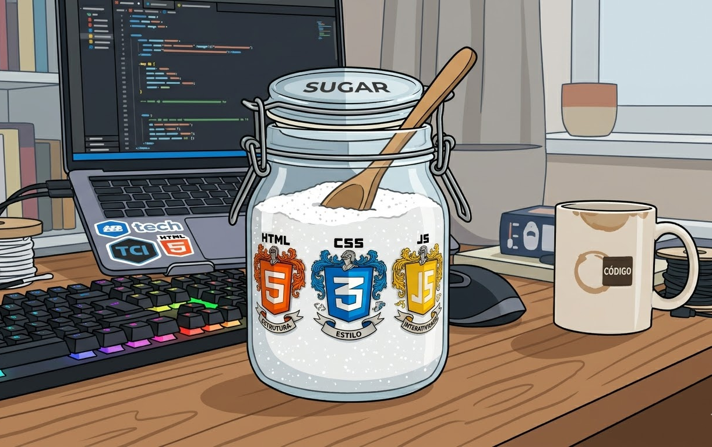

# Sugar

<p align="center">
  
</p>

A concise language that compiles to HTML, CSS, and JavaScript — designed to reduce token consumption when generating or processing web code with LLMs.

Sugar achieves ~1.28x compression over equivalent HTML/JS output, meaning LLMs can produce the same result using ~22% fewer tokens. It combines ideas from Pug, Stylus, and CoffeeScript into a single indentation-based syntax.

## Install

```bash
pip install abstra-sugar
```

## Usage

```python
from abstra_sugar import sugar

html = sugar(open("page.sugar").read())
```

## Example

```sugar
html:
 head:
  style:
   .title:
    color: #333
    font-size: 24px
 body:
  h1.title: Hello World
  p: Welcome to Sugar
  ul:
   : Simple
   : Fast
   : Clean
  script:
   greet(name):
    console.log(`Hello, ${name}!`)
   greet("World")
```

Compiles to:

```html
<html>
 <head>
  <style>
   .title {
    color: #333;
    font-size: 24px;
   }
  </style>
 </head>
 <body>
  <h1 class="title">Hello World</h1>
  <p>Welcome to Sugar</p>
  <ul>
   <li>Simple</li>
   <li>Fast</li>
   <li>Clean</li>
  </ul>
  <script>
   function greet(name) {
    console.log(`Hello, ${name}!`);
   }
   greet("World");
  </script>
 </body>
</html>
```

## Features

| Feature | Sugar | Compiles to |
|---|---|---|
| Element | `div:` | `<div></div>` |
| Implicit div | `.foo:` | `<div class="foo"></div>` |
| Text | `h1: Hello` | `<h1>Hello</h1>` |
| Implicit child | `ul: : Item` | `<ul><li>Item</li></ul>` |
| Void element | `hr:` | `<hr>` |
| Comment | `# note` | `<!-- note -->` / `// note` / `/* note */` |
| CSS property | `color: red` | `color: red;` |
| CSS mixin | `@reset()` | *(expands properties)* |
| JS function | `greet(x):` | `function greet(x) {` |
| JS arrow | `(x): x * 2` | `(x) => x * 2` |
| JS for loop | `for x of arr:` | `for (let x of arr) {` |
| JS if | `if x > 0:` | `if (x > 0) {` |
| JS class | `class Foo:` | `class Foo {` |
| Flat object | `obj =:` + keys | `{key: value, ...}` |
| Array | `arr =:` + values | `[value, ...]` |
| Comprehension | `[x*2 for x of arr]` | `arr.map((x) => x*2)` |
| Component | `card = (title):` | *(reusable template)* |
| Slot | `slot:` | *(replaced by call children)* |

## Template Literals

Inside `script:` blocks:

```sugar
script:
 # html!: — Sugar → HTML in JS template literal
 el.innerHTML = html!:
  h1: Hello {name}
  p: Welcome

 # text!: — raw multiline text
 msg = text!:
  Hello, {name}!
  Welcome to Sugar.

 # table!: — tabular data → array of objects
 users = table!:
  name    | age | role
  "Alice" | 30  | "admin"
  "Bob"   | 25  | "user"
```

In HTML context:

```sugar
# table!: → <table> with <thead>/<tbody>
table!.striped:
 Name  | Age | City
 Alice | 30  | NYC
 Bob   | 25  | LA

# markdown!: → rendered HTML
markdown!.prose:
 # Hello
 This is **bold**.

# math!: — LaTeX → MathML
math!:
 E = mc^2

# svg!: — simplified SVG
svg! 200x200:
 circle 100 100 r=50 fill=red
 path stroke=blue:
  M 0 0
  L 200 200
  Z
```

## Architecture

```
sugar(string) → string

 scan(code)    →  List[Token]      # lexer.py
 parse(tokens) →  List[Node]       # parser.py
 compile(nodes) → string           # compiler.py
```

## License

MIT — see [LICENSE](LICENSE).
